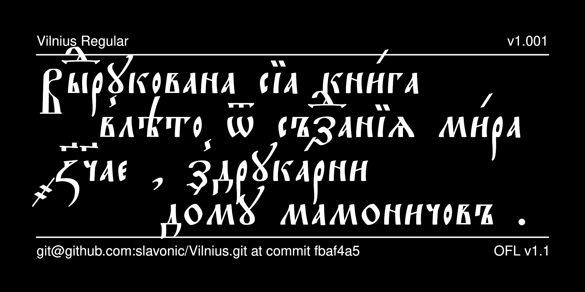

# Vilnius Typeface

Vilnius is a typeface designed to mimic the fonts used by the Mamonichi Press in Vilnius, which produced important editions in the late 16th and early 17th century. It is intended for reproducing Ruthenian publications from that era.



## History

Vilnius is based on Ostrog, designed by [Vlad Dorosh](http://irmologion.ru/fonts.html#Ostrog).
It was reencoded for Unicode by Aleksandr Andreev as part of the
[Slavonic Computing Initiative](https://sci.ponomar.net/fonts.html)
and edited by Nikita Simmons, released under SIL OFL v. 1.1 and distributed as Vilnius.

## License

This Font Software is licensed under the SIL Open Font License,
Version 1.1. This license is available with a FAQ at
[https://openfontlicense.org/](https://openfontlicense.org/).

## Building the Fonts

The font source is stored in a FontForge SFD file in the `sources/` directory. All modifications should be made in FontForge, resulting in an updated SFD file. This file is then converted to UFO format by running the convert script. From terminal:

```
cd your/local/project/directory
./convert.sh
```

The font can then be built using fontmake and gftools by running:

```
make build
```

Note that this requires Python and will install all of the necessary libraries and tools into a virtualenv at `venv/`.

To delete the virtualenv and the results of the build, run:

```
make clean
```

To build the sample image the sits at the top of this README, run:

```
make images
```

The commands `make update` and `make update-project-template` update the repository structure and Python dependencies and should be run periodically.

Google's master repository also had a GitHub workflow for building the fonts in the cloud on push, but this seems to always fail because of incorrect dependencies, so has been disabled. Instead, built binaries are stored on GitHub in the `fonts/` directory.

## Features

* The font provides a number of ligatures, which are made by inserting the Zero Width Joiner (U+200D) between two characters.

* Stylistic Set 10 (“Equal Baseline Variants”) sets the capital letters on the same baseline as the lowercase letters (useful for working
with the font in an academic context where the traditionally lowered baseline of uppercase letters can cause vertical spacing issues when working with text that is both in Latin and Cyrillic scripts). 

* Stylistic Alternatives (*salt*) are provided for the following characters:
- alternative form of U+0426 Capital Tse
- lower truncated forms of U+0434 de, U+0440 re, U+0443 u, U+0444 ef, U+0445 khe, U+0446 tse, U+0449 shche, U+0463 yat, U+0471 psi, U+A641 zelo
- alternative form of U+0478 digraph uk
- alternative form of U+1C88 variant uk
- upper trunctated forms of U+A64B uk

See your software's documentation about how to access these glyphs.

## More Church Slavonic Fonts

See the [main repository](https://github.com/typiconman/fonts-cu/issues) and the [website](https://sci.ponomar.net/fonts.html).